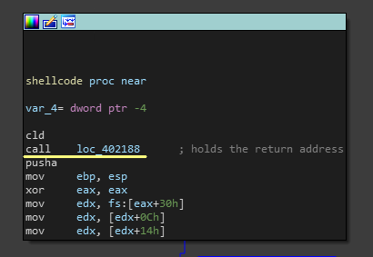
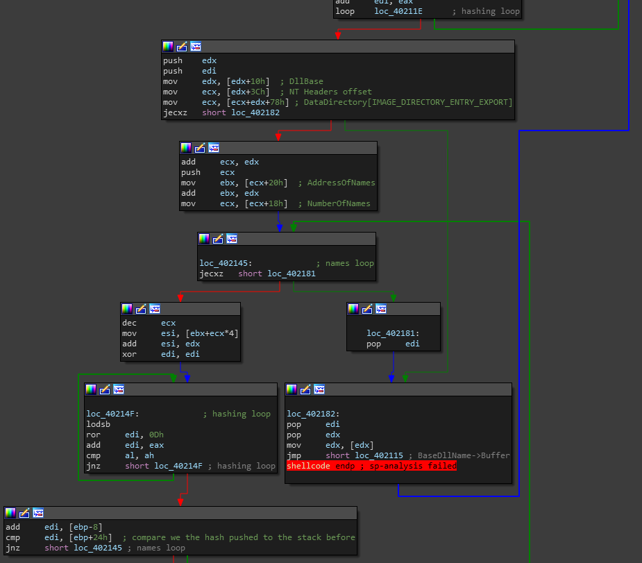
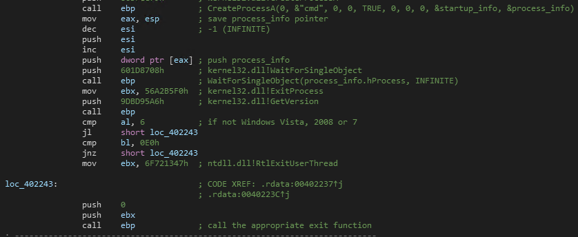

# A Look at Metasploit's Shellcodes


*Published on Medium: https://medium.com/@hidocohen/a-look-at-metasploits-shellcodes-4c21de5e4580*

For those of you that haven't heard about Metasploit before, here's quick reference from Metasploit's docs:

> The Metasploit Framework is a Ruby-based, modular penetration testing platform that enables you to write, test, and execute exploit code. The Metasploit Framework contains a suite of tools that you can use to test security vulnerabilities, enumerate networks, execute attacks, and evade detection ' [Metasploit Framework](https://docs.rapid7.com/metasploit/msf-overview/#metasploit-framework).

Metasploit provides different payloads for achieving different tasks, today we are going to investigate two of those payloads:

* windows/shell_bind_tcp

* windows/shell_reverse_tcp

My goal is to show you what's happening under the hood when using those shellcodes as a malicious payload while using Metasploit.

## Execution Wrapper

Before we start with the analysis, we need to build an application which will execute the shellcode. That way, we'll be able to perform dynamic analysis in case weΓÇÖll need it.

For that purpose, we can use *msfvenom - which is part of the Metasploit Framework -* and create a char array that contains the payload.

```bash
msfvenom -p windows/shell_bind_tcp LPORT=4444 -f c

Output:
unsigned char buf[] = "\xfc\xe8\x82\x00....\xff\xd5";
```

Next, we need to write a program which allocates new memory section for the payload, copies it to the new section and transfers the execution to the start of the payload:

```cpp
#include <Windows.h>

int main() {
    unsigned char shellcode[] = "...";

    PVOID shellcode_exec = VirtualAlloc(NULL, sizeof(shellcode), MEM_COMMIT | MEM_RESERVE, PAGE_EXECUTE_READWRITE);
    
    if (shellcode_exec) {
        RtlCopyMemory(shellcode_exec, shellcode, sizeof(shellcode));
        DWORD dwThreadId;
        HANDLE hThread = CreateThread(NULL, 0, (PTHREAD_START_ROUTINE)shellcode_exec, NULL, 0, &dwThreadId);
        if (hThread != 0) {
            WaitForSingleObject(hThread, INFINITE);
        }
    }

    return 0;
}
```

## Shellcode's Analysis

After building our program, the next step is loading the executable into IDA, navigate to the shellcode's address and define it as a function. Now, we can start our analysis.



We can see right at the beginning of the shellcode a call to a different location, peeking inside will reveal the following:


The shellcodes popped out the return address and saved it inside `ebp`, it pushed "ws2_32", a pointer to that string and weird hex value into the stack. Then, it calls to `ebp` - which contains the address of `pusha` instruction in the main function. Which means that the execution got back to the main function with new values pushed to the stack.

***Hashing Algorithm***

Let's go back to the main function and try to understand how it uses the new values in the stack.


Using the `_PEB` structure, the shellcode loops over the modules loaded into our program. For each module it calculates an hash value according to the module's name with the following steps:

1. Transform module name to uppercase

2. ROR13 the accumulated hash value

3. Add the current char to the result

4. Repeat 1-3 for each module's name char

We can write a simple python script which calculates the hash of a given string (could be useful later):

```python
def ror(dword, bits):
    return (dword >> bits | dword << (32 - bits)) & 0xFFFFFFFF

def unicode(string, uppercase=True):
    result = ''
    if uppercase:
        string = string.upper()
    for c in string:
        result += c + '\x00'
    return result

def cal_hash(name, bits=13):
    hash = 0
    
    for c in unicode(module + '\x00'):
        hash = ror(hash, bits)
        hash += ord(c)

    print(hash)
```

Moving on, we see that the shellcode uses the same ROR13 hashing for each exported function name of the module:

*Exported functions name hashing loop*

The shellcode gets the module base address by using a pointer to `_LDR_DATA_TABLE_ENTRY` structure saved earlier. Then, it parses the PE headers of the module and iterating over the export table function names. For each exported function name, it calculates the hash and adds the resulting value to the module's name hash. The loop stops when that value is equal to a value on the stack.

The value which the hash's compared to is actually the weird hex value pushed into the stack by the first function (`loc_402188`). So we can infer that the first function pushed known hash value for a specific function name, but how could we find what functions the shellcode looks for? We can answer that question using two different methods:

1. Brute-force - We could use the python script written earlier, calculate the hashes for known WinAPI functions, store the result in a dictionary and search the hashes used in the shellcode inside that dictionary.

2. Debugging - By loading the program in *x32dbg* and placing a breakpoint where the function has been found:


Note that esi equals to `LoadLibraryExA` but that's not the function we are looking for. Before making the comparison, esi advanced to the next exported function name, so the function we need is one before `LoadLibraryExA` - which is in fact, `LoadLibraryA` . Repeating this process will provide us the remaining function names.

***Functions Invocation***

The shellcode has found the function name it looked for, now, it needs to invoke it:


In order to be able to call the function, the shellcode first needs to find its address inside the current process's address space. The shellcode gets the address which located at `AddressOfFunctions[FunctionOrdinalNumber]`.

Next, the stack needs to be fixed. Why? Because before jumping back to the main function the shellcode messed the stack. If you recall, it popped out the return address and pushed the hash, string and a string pointer into the stack.

After fixing the stack, the shellcode's ready for invoking the function.

***Execution Flow***

WeΓÇÖve figured out that the main function of the shellcode is responsible for finding a function according to a pre-calculated hash and executing it. Which means that the general execution flow controlled by the first function, so, lets see what functions being executed:


In this code section, the shellcode creates a new socket and listens for new connections on port 4444. Once new connection created the shellcodes continues its execution:


The listening socket closed, and the new socket connects to the input, output and error stream - allowing the attacker to run commands remotely.

Once the cmd.exe process closed, the shellcodes exits using the appropriate exit function according to the infected system version:



To summarize, the shellcode executes the following functions:

```cpp
LoadLibraryA("ws2_32");
WSAStartup(0x0190, &WSAData);
WSASocketA(AF_INET, SOCK_STREAM, 0, 0, 0, 0);;
bind(socket, &sockaddr_in, 0x10);
listen(socket, 0);
new_socket = accept(socket, 0, 0);
closesocket(socket); // close listening socket

CreateProcess(0, &ΓÇ¥cmdΓÇ¥, 0, 0, TRUE, 0, 0, 0, &si, &pi);
WaitForSingleObject(pi.hProcess, INFINITE);
ExitProcess();
```

### ***Applying what weΓÇÖve learned to analyze other shellcodes***

At this point we have a good understanding about how Metasploit's `windows/shell_bind_tcp` shellcode works under the hood. We can move on to other shellcodes and see if we can utilize our new knowledge for faster analysis. I took `windows/shell_reverse_tcp` as an example. All we have to do is to paste *msfvenom* - new output in our program, compile and load it back to IDA.

The main difference between the two is the way the socket being created:


Instead of binding and listening for new connection, the shellcode's trying to connect to a given IP address 5 times. Once it succeeds, same *cmd.exe* process is being created. And that's it, we know how `windows/shell_reverse_tcp` works :)

## In Conclusion

We've learned about 2 different shellcodes produced by Metasploit Framework, `windows/shell_bind_tcp` and `windows/shell_reverse_tcp` . We started by understanding how functions being executed while utilizing *python*/*x32dbg*. Then, we investigated how those functions are used for achieving each shellcode's goal.

Hope you've found this blog post informative :)
